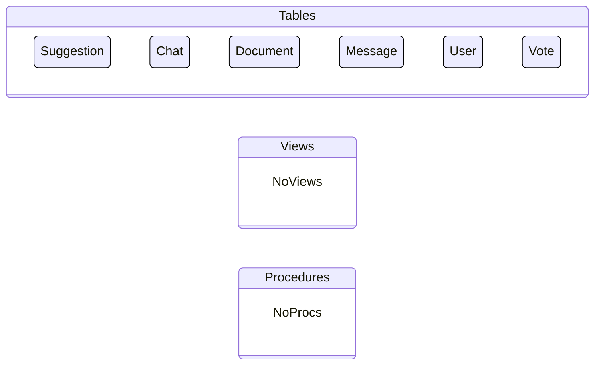

## dab-config.json

&nbsp;

### Tables
|Entity|Source|Relationships
|-|-|-
|Suggestion|public.suggestion|-
|Chat|public.chat|-
|Document|public.document|-
|Message|public.message|-
|User|public.user|-
|Vote|public.vote|-

### Views
> None

### Stored Procedures
> None

